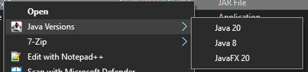

# About
*Windows-Only*  
These scripts are examples for aliases that allow you to run a java program with a separate version of java.  
These scripts can also be added to the context menu for .jar files by modifying the registry!  
